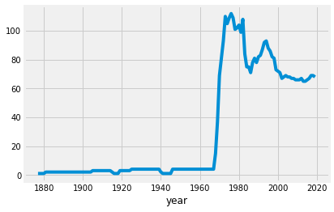
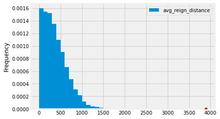

# A first attempt at data exploration.
#### by Todd Hakman

This is my first dive into data analysis, and I wanted to begin with one of my interests, tennis.
I found the data I am using on https://github.com/serve-and-volley/atp-world-tour-tennis-data.


```python
# Bringing in a few packages that I have learned about auditing DSC 10 in Fall 2020 from UCSD. (dsc10.com)
# While they used babypandas I am going to make my first attempt at using regular pandas.
import numpy as np
import pandas as pd
import math
import datetime
import time

# I copied these lines from the DSC 10 typical setup, as I do not know matplotlib yet.
import matplotlib
import matplotlib.pyplot as plt
plt.style.use('fivethirtyeight')
%matplotlib inline
```

The data from *serve-and-volley* came separated by decade, so I compiled them all into a single csv file for use. I pulled the column titles from their github page and added a row of column titles so that when pandas reads the csv it will get the correct column titles.


```python
tournaments = pd.read_csv('data/tournaments.csv').set_index('tourney_year_id')
tournaments
```


<div>
<style scoped>
    .dataframe tbody tr th:only-of-type {
        vertical-align: middle;
    }

    .dataframe tbody tr th {
        vertical-align: top;
    }

    .dataframe thead th {
        text-align: right;
    }
</style>
<table border="1" class="dataframe">
  <thead>
    <tr style="text-align: right;">
      <th></th>
      <th>tourney_order</th>
      <th>tourney_type</th>
      <th>tourney_name</th>
      <th>tourney_id</th>
      <th>tourney_slug</th>
      <th>tourney_location</th>
      <th>tourney_date</th>
      <th>year</th>
      <th>tourney_month</th>
      <th>tourney_day</th>
      <th>...</th>
      <th>singles_winner_player_slug</th>
      <th>singles_winner_player_id</th>
      <th>doubles_winner_1_name</th>
      <th>doubles_winner_1_url</th>
      <th>doubles_winner_1_player_slug</th>
      <th>doubles_winner_1_player_id</th>
      <th>doubles_winner_2_name</th>
      <th>doubles_winner_2_url</th>
      <th>doubles_winner_2_player_slug</th>
      <th>doubles_winner_2_player_id</th>
    </tr>
    <tr>
      <th>tourney_year_id</th>
      <th></th>
      <th></th>
      <th></th>
      <th></th>
      <th></th>
      <th></th>
      <th></th>
      <th></th>
      <th></th>
      <th></th>
      <th></th>
      <th></th>
      <th></th>
      <th></th>
      <th></th>
      <th></th>
      <th></th>
      <th></th>
      <th></th>
      <th></th>
      <th></th>
    </tr>
  </thead>
  <tbody>
    <tr>
      <th>1877-540</th>
      <td>1</td>
      <td>Grand Slam</td>
      <td>Wimbledon</td>
      <td>540.0</td>
      <td>wimbledon</td>
      <td>London, Great Britain</td>
      <td>1877.07.09</td>
      <td>1877</td>
      <td>7.0</td>
      <td>9.0</td>
      <td>...</td>
      <td>spencer-gore</td>
      <td>gi91</td>
      <td>NaN</td>
      <td>NaN</td>
      <td>NaN</td>
      <td>NaN</td>
      <td>NaN</td>
      <td>NaN</td>
      <td>NaN</td>
      <td>NaN</td>
    </tr>
    <tr>
      <th>1878-540</th>
      <td>1</td>
      <td>Grand Slam</td>
      <td>Wimbledon</td>
      <td>540.0</td>
      <td>wimbledon</td>
      <td>London, Great Britain</td>
      <td>1878.07.08</td>
      <td>1878</td>
      <td>7.0</td>
      <td>8.0</td>
      <td>...</td>
      <td>frank-hadow</td>
      <td>hg50</td>
      <td>NaN</td>
      <td>NaN</td>
      <td>NaN</td>
      <td>NaN</td>
      <td>NaN</td>
      <td>NaN</td>
      <td>NaN</td>
      <td>NaN</td>
    </tr>
    <tr>
      <th>1879-540</th>
      <td>1</td>
      <td>Grand Slam</td>
      <td>Wimbledon</td>
      <td>540.0</td>
      <td>wimbledon</td>
      <td>London, Great Britain</td>
      <td>1879.07.07</td>
      <td>1879</td>
      <td>7.0</td>
      <td>7.0</td>
      <td>...</td>
      <td>john-hartley</td>
      <td>hg35</td>
      <td>NaN</td>
      <td>NaN</td>
      <td>NaN</td>
      <td>NaN</td>
      <td>NaN</td>
      <td>NaN</td>
      <td>NaN</td>
      <td>NaN</td>
    </tr>
    <tr>
      <th>1880-540</th>
      <td>1</td>
      <td>Grand Slam</td>
      <td>Wimbledon</td>
      <td>540.0</td>
      <td>wimbledon</td>
      <td>London, Great Britain</td>
      <td>1880.07.05</td>
      <td>1880</td>
      <td>7.0</td>
      <td>5.0</td>
      <td>...</td>
      <td>john-hartley</td>
      <td>hg35</td>
      <td>NaN</td>
      <td>NaN</td>
      <td>NaN</td>
      <td>NaN</td>
      <td>NaN</td>
      <td>NaN</td>
      <td>NaN</td>
      <td>NaN</td>
    </tr>
    <tr>
      <th>1881-540</th>
      <td>1</td>
      <td>Grand Slam</td>
      <td>Wimbledon</td>
      <td>540.0</td>
      <td>wimbledon</td>
      <td>London, Great Britain</td>
      <td>1881.07.02</td>
      <td>1881</td>
      <td>7.0</td>
      <td>2.0</td>
      <td>...</td>
      <td>william-renshaw</td>
      <td>rg71</td>
      <td>NaN</td>
      <td>NaN</td>
      <td>NaN</td>
      <td>NaN</td>
      <td>NaN</td>
      <td>NaN</td>
      <td>NaN</td>
      <td>NaN</td>
    </tr>
    <tr>
      <th>...</th>
      <td>...</td>
      <td>...</td>
      <td>...</td>
      <td>...</td>
      <td>...</td>
      <td>...</td>
      <td>...</td>
      <td>...</td>
      <td>...</td>
      <td>...</td>
      <td>...</td>
      <td>...</td>
      <td>...</td>
      <td>...</td>
      <td>...</td>
      <td>...</td>
      <td>...</td>
      <td>...</td>
      <td>...</td>
      <td>...</td>
      <td>...</td>
    </tr>
    <tr>
      <th>2019-337</th>
      <td>64</td>
      <td>ATP 500</td>
      <td>Vienna</td>
      <td>337.0</td>
      <td>vienna</td>
      <td>Vienna, Austria</td>
      <td>2019.10.21</td>
      <td>2019</td>
      <td>10.0</td>
      <td>21.0</td>
      <td>...</td>
      <td>dominic-thiem</td>
      <td>tb69</td>
      <td>Rajeev Ram</td>
      <td>/en/players/rajeev-ram/r548/overview</td>
      <td>rajeev-ram</td>
      <td>r548</td>
      <td>Joe Salisbury</td>
      <td>/en/players/joe-salisbury/so70/overview</td>
      <td>joe-salisbury</td>
      <td>so70</td>
    </tr>
    <tr>
      <th>2019-328</th>
      <td>65</td>
      <td>ATP 500</td>
      <td>Basel</td>
      <td>328.0</td>
      <td>basel</td>
      <td>Basel, Switzerland</td>
      <td>2019.10.21</td>
      <td>2019</td>
      <td>10.0</td>
      <td>21.0</td>
      <td>...</td>
      <td>roger-federer</td>
      <td>f324</td>
      <td>Jean-Julien Rojer</td>
      <td>/en/players/jean-julien-rojer/r513/overview</td>
      <td>jean-julien-rojer</td>
      <td>r513</td>
      <td>Horia Tecau</td>
      <td>/en/players/horia-tecau/t749/overview</td>
      <td>horia-tecau</td>
      <td>t749</td>
    </tr>
    <tr>
      <th>2019-352</th>
      <td>66</td>
      <td>Masters 1000</td>
      <td>ATP Masters 1000 Paris</td>
      <td>352.0</td>
      <td>paris</td>
      <td>Paris, France</td>
      <td>2019.10.28</td>
      <td>2019</td>
      <td>10.0</td>
      <td>28.0</td>
      <td>...</td>
      <td>novak-djokovic</td>
      <td>d643</td>
      <td>Pierre-Hugues Herbert</td>
      <td>/en/players/pierre-hugues-herbert/h996/overview</td>
      <td>pierre-hugues-herbert</td>
      <td>h996</td>
      <td>Nicolas Mahut</td>
      <td>/en/players/nicolas-mahut/m873/overview</td>
      <td>nicolas-mahut</td>
      <td>m873</td>
    </tr>
    <tr>
      <th>2019-7696</th>
      <td>67</td>
      <td>Next Gen Finals</td>
      <td>Next Gen ATP Finals</td>
      <td>7696.0</td>
      <td>next-gen-atp-finals</td>
      <td>Milan, Italy</td>
      <td>2019.11.05</td>
      <td>2019</td>
      <td>11.0</td>
      <td>5.0</td>
      <td>...</td>
      <td>jannik-sinner</td>
      <td>s0ag</td>
      <td>NaN</td>
      <td>NaN</td>
      <td>NaN</td>
      <td>NaN</td>
      <td>NaN</td>
      <td>NaN</td>
      <td>NaN</td>
      <td>NaN</td>
    </tr>
    <tr>
      <th>2019-605</th>
      <td>68</td>
      <td>ATP Finals</td>
      <td>Nitto ATP Finals</td>
      <td>605.0</td>
      <td>nitto-atp-finals</td>
      <td>London, Great Britain</td>
      <td>2019.11.10</td>
      <td>2019</td>
      <td>11.0</td>
      <td>10.0</td>
      <td>...</td>
      <td>stefanos-tsitsipas</td>
      <td>te51</td>
      <td>Pierre-Hugues Herbert</td>
      <td>/en/players/pierre-hugues-herbert/h996/overview</td>
      <td>pierre-hugues-herbert</td>
      <td>h996</td>
      <td>Nicolas Mahut</td>
      <td>/en/players/nicolas-mahut/m873/overview</td>
      <td>nicolas-mahut</td>
      <td>m873</td>
    </tr>
  </tbody>
</table>
<p>4354 rows × 30 columns</p>
</div>


I initially set the index as the **tourney_year_id** as this appears to be a combination of year and unique tournament identifier. This should mean that each **tourney_year_id** is a unique value and a good option for the index, as a tournament cannot occur twice in the same year. For my own sake and the reader's, this is what each column represents:

- **tourney_order** appears to be the order in the year that the tournament took place
- **tourney_type** is the type of tournament it is, if any (e.g. Grand Slam or ATP 250)
- **tourney_name** is the name of the tournament
- **tourney_id** is a unique identifier for each tournament
- **tourney_slug** is a reference for the tournament in the url format that www.atptour.com uses
- **tourney_location** is the 'city, country' of the tournament
- **tourney_date** is the date of the tournament in yyyy.mm.dd format
- **year** is the year of the tournament
- **tourney_month** is the month of the tournament
- **tourney_day** is the day of the tournament
- **tourney_singles_draw** is the number of entrants in the singles part of the tournament, if any
- **tourney_doubles_draw** is the number of entrants in the doubles part of the tournament, if any
- **tourney_conditions** is whether the tournament was indoors or outdoors.
- **tourney_surface** is the surface the tournament was on
- **tourney_fin_commit_raw** is the total prize money in the tournament, if any, with currency symbols and commas
- **currency** is the currency for the prize money of the tournament
- **tourney_fin_commit** is a formatted prize money for the tournament, if any
- **tourney_url_suffix** is the suffix that can be appended to www.atptour.com for the tournament
- **singles_winner_name** is the name of the winner of the tournament
- **singles_winner_url** is the suffix that can be appended to www.atptour.com for the winner's profile
- **singles_winner_slug** is the name of the winner in the url format that www.atptour.com uses
- **singles_winner_player_id** is the player id of the winner in the url format that www.atptour.com uses
- **doubles_winner_1_name** is the name of the first partner winner of the tournament
- **doubles_winner_1_url** is the suffix that can be appended to www.atptour.com for the winner's profile
- **doubles_winner_1_slug** is the name of the winner in the url format that www.atptour.com uses
- **doubles_winner_1_player_id** is the player id of the winner in the url format that www.atptour.com uses
- **doubles_winner_2_name** is the name of the second partner winner of the tournament
- **doubles_winner_2_url** is the suffix that can be appended to www.atptour.com for the winner's profile
- **doubles_winner_2_slug** is the name of the winner in the url format that www.atptour.com uses
- **doubles_winner_2_player_id** is the player id of the winner in the url format that www.atptour.com uses

Lets take a look at the number of tournaments per year to get an idea of how often tournaments are held.


```python
#Group our data by year and get a count, then take a look at any column that would be representative of a count, and plot it
tournaments.groupby('year').count().get('tourney_order').plot()
```


    <matplotlib.axes._subplots.AxesSubplot at 0x2620891fca0>





We see a huge jump in tournaments around the mid to late 1960's. What happened around this time? Per wikipedia:

> The "Open Era" began in 1968 when Grand Slam tournaments agreed to allow professional players to compete with amateurs.[65] Before 1968, only amateurs were allowed to compete in Grand Slam tournaments and other events organized or sanctioned by the ILTF, including the Davis Cup. [URL](https://en.wikipedia.org/wiki/History_of_tennis#Open_Era)

> Before the Open era, prior to the establishment of the ATP World Tour and WTA Tour, top professional players traveled largely as a group putting on a show, similar to the circus coming to town. Grand Slams were only open to amateurs. [URL](https://bleacherreport.com/articles/2691000-breaking-down-the-biggest-changes-in-tennis-that-define-the-open-era)

As we are now in the Open Era, a lot of people split the two eras up when considering stats.


```python
pre_open_era = tournaments[tournaments.get('year') < 1968]
open_era = tournaments[tournaments.get('year') >= 1968]
print('There were', pre_open_era.shape[0], 'tournaments in the pre-open era, and', open_era.shape[0], 'tournaments in the open era so far.')
```

    There were 260 tournaments in the pre-open era, and 4094 tournaments in the open era so far.
    

I wonder if there were any players who won singles tournaments in both eras? I think we can find this out by grouping each set by the **singles_winner_player_id** and then doing a merge on both Data Frames, resulting in a list of players who won in both eras. Let's see.


```python
pre_open_winners = pre_open_era.groupby('singles_winner_player_id').count()
open_winners = open_era.groupby('singles_winner_player_id').count()
both_era_winners = pre_open_winners.merge(open_winners, left_index=True, right_index=True)
both_era_winners
```


<div>
<style scoped>
    .dataframe tbody tr th:only-of-type {
        vertical-align: middle;
    }

    .dataframe tbody tr th {
        vertical-align: top;
    }

    .dataframe thead th {
        text-align: right;
    }
</style>
<table border="1" class="dataframe">
  <thead>
    <tr style="text-align: right;">
      <th></th>
      <th>tourney_order_x</th>
      <th>tourney_type_x</th>
      <th>tourney_name_x</th>
      <th>tourney_id_x</th>
      <th>tourney_slug_x</th>
      <th>tourney_location_x</th>
      <th>tourney_date_x</th>
      <th>year_x</th>
      <th>tourney_month_x</th>
      <th>tourney_day_x</th>
      <th>...</th>
      <th>singles_winner_url_y</th>
      <th>singles_winner_player_slug_y</th>
      <th>doubles_winner_1_name_y</th>
      <th>doubles_winner_1_url_y</th>
      <th>doubles_winner_1_player_slug_y</th>
      <th>doubles_winner_1_player_id_y</th>
      <th>doubles_winner_2_name_y</th>
      <th>doubles_winner_2_url_y</th>
      <th>doubles_winner_2_player_slug_y</th>
      <th>doubles_winner_2_player_id_y</th>
    </tr>
    <tr>
      <th>singles_winner_player_id</th>
      <th></th>
      <th></th>
      <th></th>
      <th></th>
      <th></th>
      <th></th>
      <th></th>
      <th></th>
      <th></th>
      <th></th>
      <th></th>
      <th></th>
      <th></th>
      <th></th>
      <th></th>
      <th></th>
      <th></th>
      <th></th>
      <th></th>
      <th></th>
      <th></th>
    </tr>
  </thead>
  <tbody>
    <tr>
      <th>a060</th>
      <td>1</td>
      <td>1</td>
      <td>1</td>
      <td>1</td>
      <td>1</td>
      <td>1</td>
      <td>1</td>
      <td>1</td>
      <td>1</td>
      <td>1</td>
      <td>...</td>
      <td>2</td>
      <td>2</td>
      <td>0</td>
      <td>0</td>
      <td>0</td>
      <td>0</td>
      <td>0</td>
      <td>0</td>
      <td>0</td>
      <td>0</td>
    </tr>
    <tr>
      <th>e030</th>
      <td>12</td>
      <td>12</td>
      <td>12</td>
      <td>12</td>
      <td>12</td>
      <td>12</td>
      <td>12</td>
      <td>12</td>
      <td>12</td>
      <td>12</td>
      <td>...</td>
      <td>3</td>
      <td>3</td>
      <td>2</td>
      <td>2</td>
      <td>2</td>
      <td>2</td>
      <td>2</td>
      <td>2</td>
      <td>2</td>
      <td>2</td>
    </tr>
    <tr>
      <th>g077</th>
      <td>2</td>
      <td>2</td>
      <td>2</td>
      <td>2</td>
      <td>2</td>
      <td>2</td>
      <td>2</td>
      <td>2</td>
      <td>2</td>
      <td>2</td>
      <td>...</td>
      <td>7</td>
      <td>7</td>
      <td>2</td>
      <td>2</td>
      <td>2</td>
      <td>2</td>
      <td>2</td>
      <td>2</td>
      <td>2</td>
      <td>2</td>
    </tr>
    <tr>
      <th>l058</th>
      <td>6</td>
      <td>6</td>
      <td>6</td>
      <td>6</td>
      <td>6</td>
      <td>6</td>
      <td>6</td>
      <td>6</td>
      <td>6</td>
      <td>6</td>
      <td>...</td>
      <td>52</td>
      <td>52</td>
      <td>37</td>
      <td>37</td>
      <td>37</td>
      <td>37</td>
      <td>37</td>
      <td>37</td>
      <td>37</td>
      <td>37</td>
    </tr>
    <tr>
      <th>n044</th>
      <td>2</td>
      <td>2</td>
      <td>2</td>
      <td>2</td>
      <td>2</td>
      <td>2</td>
      <td>2</td>
      <td>2</td>
      <td>2</td>
      <td>2</td>
      <td>...</td>
      <td>34</td>
      <td>34</td>
      <td>27</td>
      <td>27</td>
      <td>27</td>
      <td>27</td>
      <td>27</td>
      <td>27</td>
      <td>27</td>
      <td>27</td>
    </tr>
    <tr>
      <th>o042</th>
      <td>2</td>
      <td>2</td>
      <td>2</td>
      <td>2</td>
      <td>2</td>
      <td>2</td>
      <td>2</td>
      <td>2</td>
      <td>2</td>
      <td>2</td>
      <td>...</td>
      <td>1</td>
      <td>1</td>
      <td>0</td>
      <td>0</td>
      <td>0</td>
      <td>0</td>
      <td>0</td>
      <td>0</td>
      <td>0</td>
      <td>0</td>
    </tr>
    <tr>
      <th>r073</th>
      <td>1</td>
      <td>1</td>
      <td>1</td>
      <td>1</td>
      <td>1</td>
      <td>1</td>
      <td>1</td>
      <td>1</td>
      <td>1</td>
      <td>1</td>
      <td>...</td>
      <td>11</td>
      <td>11</td>
      <td>7</td>
      <td>7</td>
      <td>7</td>
      <td>7</td>
      <td>7</td>
      <td>7</td>
      <td>7</td>
      <td>7</td>
    </tr>
    <tr>
      <th>r075</th>
      <td>4</td>
      <td>4</td>
      <td>4</td>
      <td>4</td>
      <td>4</td>
      <td>4</td>
      <td>4</td>
      <td>4</td>
      <td>4</td>
      <td>4</td>
      <td>...</td>
      <td>35</td>
      <td>35</td>
      <td>24</td>
      <td>24</td>
      <td>24</td>
      <td>24</td>
      <td>24</td>
      <td>24</td>
      <td>24</td>
      <td>24</td>
    </tr>
    <tr>
      <th>s129</th>
      <td>2</td>
      <td>2</td>
      <td>2</td>
      <td>2</td>
      <td>2</td>
      <td>2</td>
      <td>2</td>
      <td>2</td>
      <td>2</td>
      <td>2</td>
      <td>...</td>
      <td>3</td>
      <td>3</td>
      <td>3</td>
      <td>3</td>
      <td>3</td>
      <td>3</td>
      <td>3</td>
      <td>3</td>
      <td>3</td>
      <td>3</td>
    </tr>
    <tr>
      <th>s245</th>
      <td>4</td>
      <td>4</td>
      <td>4</td>
      <td>4</td>
      <td>4</td>
      <td>4</td>
      <td>4</td>
      <td>4</td>
      <td>4</td>
      <td>4</td>
      <td>...</td>
      <td>1</td>
      <td>1</td>
      <td>0</td>
      <td>0</td>
      <td>0</td>
      <td>0</td>
      <td>0</td>
      <td>0</td>
      <td>0</td>
      <td>0</td>
    </tr>
  </tbody>
</table>
<p>10 rows × 58 columns</p>
</div>


Who are these players? Some python can help us figure that out!


```python
for i in both_era_winners.index:
    print(tournaments[tournaments.get('singles_winner_player_id') == i].get('singles_winner_name').iloc[0])
```

    Mal Anderson
    Roy Emerson
    Richard Pancho Gonzales
    Rod Laver
    John Newcombe
    Alejandro Olmedo
    Tony Roche
    Ken Rosewall
    Fred Stolle
    Manuel Santana
    

Is that a lot? 10 players? Let's see if we can find out. I want to start by calculating the time between first and last tournament wins for each winner, and see what the typical period of winning looks like. I only want to include players who won at least 2 tournaments, as each of these 10 players must have won 2 as well. We may look at this average for pre-open era and open era as well to compare. We can write a function in python that takes a list of player ids, and for each one, finds the first and last win and gets the time between them.


```python
#a function that will take a ATP player id and return the days between the players first and last tournament win
def reign(player_id):
    date_format = '%Y.%m.%d'
    first = datetime.datetime.strptime(
        tournaments[tournaments.get('singles_winner_player_id') == player_id].get('tourney_date').iloc[0],
        date_format
    )
    last = datetime.datetime.strptime(
        tournaments[tournaments.get('singles_winner_player_id') == player_id].get('tourney_date').iloc[-1],
        date_format
    )
    if (last - first).days == 0.0:
        return 1
    else:
        return int((last - first).days)

winners = tournaments.groupby('singles_winner_player_id').count().index
winners
winner_reigns = np.empty(0, int)
for i in winners:
    winner_reigns = np.append(winner_reigns, reign(i))
winning_names = tournaments.groupby(['singles_winner_player_id', 'singles_winner_name']).count().reset_index().set_index('singles_winner_name').index
```


```python
both_era_winners
```


<div>
<style scoped>
    .dataframe tbody tr th:only-of-type {
        vertical-align: middle;
    }

    .dataframe tbody tr th {
        vertical-align: top;
    }

    .dataframe thead th {
        text-align: right;
    }
</style>
<table border="1" class="dataframe">
  <thead>
    <tr style="text-align: right;">
      <th></th>
      <th>tourney_order_x</th>
      <th>tourney_type_x</th>
      <th>tourney_name_x</th>
      <th>tourney_id_x</th>
      <th>tourney_slug_x</th>
      <th>tourney_location_x</th>
      <th>tourney_date_x</th>
      <th>year_x</th>
      <th>tourney_month_x</th>
      <th>tourney_day_x</th>
      <th>...</th>
      <th>singles_winner_url_y</th>
      <th>singles_winner_player_slug_y</th>
      <th>doubles_winner_1_name_y</th>
      <th>doubles_winner_1_url_y</th>
      <th>doubles_winner_1_player_slug_y</th>
      <th>doubles_winner_1_player_id_y</th>
      <th>doubles_winner_2_name_y</th>
      <th>doubles_winner_2_url_y</th>
      <th>doubles_winner_2_player_slug_y</th>
      <th>doubles_winner_2_player_id_y</th>
    </tr>
    <tr>
      <th>singles_winner_player_id</th>
      <th></th>
      <th></th>
      <th></th>
      <th></th>
      <th></th>
      <th></th>
      <th></th>
      <th></th>
      <th></th>
      <th></th>
      <th></th>
      <th></th>
      <th></th>
      <th></th>
      <th></th>
      <th></th>
      <th></th>
      <th></th>
      <th></th>
      <th></th>
      <th></th>
    </tr>
  </thead>
  <tbody>
    <tr>
      <th>a060</th>
      <td>1</td>
      <td>1</td>
      <td>1</td>
      <td>1</td>
      <td>1</td>
      <td>1</td>
      <td>1</td>
      <td>1</td>
      <td>1</td>
      <td>1</td>
      <td>...</td>
      <td>2</td>
      <td>2</td>
      <td>0</td>
      <td>0</td>
      <td>0</td>
      <td>0</td>
      <td>0</td>
      <td>0</td>
      <td>0</td>
      <td>0</td>
    </tr>
    <tr>
      <th>e030</th>
      <td>12</td>
      <td>12</td>
      <td>12</td>
      <td>12</td>
      <td>12</td>
      <td>12</td>
      <td>12</td>
      <td>12</td>
      <td>12</td>
      <td>12</td>
      <td>...</td>
      <td>3</td>
      <td>3</td>
      <td>2</td>
      <td>2</td>
      <td>2</td>
      <td>2</td>
      <td>2</td>
      <td>2</td>
      <td>2</td>
      <td>2</td>
    </tr>
    <tr>
      <th>g077</th>
      <td>2</td>
      <td>2</td>
      <td>2</td>
      <td>2</td>
      <td>2</td>
      <td>2</td>
      <td>2</td>
      <td>2</td>
      <td>2</td>
      <td>2</td>
      <td>...</td>
      <td>7</td>
      <td>7</td>
      <td>2</td>
      <td>2</td>
      <td>2</td>
      <td>2</td>
      <td>2</td>
      <td>2</td>
      <td>2</td>
      <td>2</td>
    </tr>
    <tr>
      <th>l058</th>
      <td>6</td>
      <td>6</td>
      <td>6</td>
      <td>6</td>
      <td>6</td>
      <td>6</td>
      <td>6</td>
      <td>6</td>
      <td>6</td>
      <td>6</td>
      <td>...</td>
      <td>52</td>
      <td>52</td>
      <td>37</td>
      <td>37</td>
      <td>37</td>
      <td>37</td>
      <td>37</td>
      <td>37</td>
      <td>37</td>
      <td>37</td>
    </tr>
    <tr>
      <th>n044</th>
      <td>2</td>
      <td>2</td>
      <td>2</td>
      <td>2</td>
      <td>2</td>
      <td>2</td>
      <td>2</td>
      <td>2</td>
      <td>2</td>
      <td>2</td>
      <td>...</td>
      <td>34</td>
      <td>34</td>
      <td>27</td>
      <td>27</td>
      <td>27</td>
      <td>27</td>
      <td>27</td>
      <td>27</td>
      <td>27</td>
      <td>27</td>
    </tr>
    <tr>
      <th>o042</th>
      <td>2</td>
      <td>2</td>
      <td>2</td>
      <td>2</td>
      <td>2</td>
      <td>2</td>
      <td>2</td>
      <td>2</td>
      <td>2</td>
      <td>2</td>
      <td>...</td>
      <td>1</td>
      <td>1</td>
      <td>0</td>
      <td>0</td>
      <td>0</td>
      <td>0</td>
      <td>0</td>
      <td>0</td>
      <td>0</td>
      <td>0</td>
    </tr>
    <tr>
      <th>r073</th>
      <td>1</td>
      <td>1</td>
      <td>1</td>
      <td>1</td>
      <td>1</td>
      <td>1</td>
      <td>1</td>
      <td>1</td>
      <td>1</td>
      <td>1</td>
      <td>...</td>
      <td>11</td>
      <td>11</td>
      <td>7</td>
      <td>7</td>
      <td>7</td>
      <td>7</td>
      <td>7</td>
      <td>7</td>
      <td>7</td>
      <td>7</td>
    </tr>
    <tr>
      <th>r075</th>
      <td>4</td>
      <td>4</td>
      <td>4</td>
      <td>4</td>
      <td>4</td>
      <td>4</td>
      <td>4</td>
      <td>4</td>
      <td>4</td>
      <td>4</td>
      <td>...</td>
      <td>35</td>
      <td>35</td>
      <td>24</td>
      <td>24</td>
      <td>24</td>
      <td>24</td>
      <td>24</td>
      <td>24</td>
      <td>24</td>
      <td>24</td>
    </tr>
    <tr>
      <th>s129</th>
      <td>2</td>
      <td>2</td>
      <td>2</td>
      <td>2</td>
      <td>2</td>
      <td>2</td>
      <td>2</td>
      <td>2</td>
      <td>2</td>
      <td>2</td>
      <td>...</td>
      <td>3</td>
      <td>3</td>
      <td>3</td>
      <td>3</td>
      <td>3</td>
      <td>3</td>
      <td>3</td>
      <td>3</td>
      <td>3</td>
      <td>3</td>
    </tr>
    <tr>
      <th>s245</th>
      <td>4</td>
      <td>4</td>
      <td>4</td>
      <td>4</td>
      <td>4</td>
      <td>4</td>
      <td>4</td>
      <td>4</td>
      <td>4</td>
      <td>4</td>
      <td>...</td>
      <td>1</td>
      <td>1</td>
      <td>0</td>
      <td>0</td>
      <td>0</td>
      <td>0</td>
      <td>0</td>
      <td>0</td>
      <td>0</td>
      <td>0</td>
    </tr>
  </tbody>
</table>
<p>10 rows × 58 columns</p>
</div>


```python
winner_data = pd.DataFrame().assign(player_id=winners, reign=winner_reigns, name=winning_names).set_index('player_id')
both_era_reigns = np.array([])
for i in both_era_winners.index:
    both_era_reigns = np.append(both_era_reigns, winner_data.get('reign').loc[i])
observed = both_era_reigns.mean() - winner_data.get('reign').mean()
    
```


```python
sample_size = 10
trials = 10000
simulations = np.array([])
for i in np.arange(trials):
    simulations = np.append(simulations, abs(winner_data.sample(sample_size).get('reign').mean() - winner_data.get('reign').mean()))
pd.DataFrame().assign(avg_reign_distance=simulations).plot(kind='hist', density=True, bins=np.arange(0, 4000, 100))
plt.scatter(observed, 0, color='red', s=30, zorder=10);
```





- What years were most competitive? Most individual winners compared to total tournaments that year.
- What years were most dominated? By who?
- Left handers win more?
